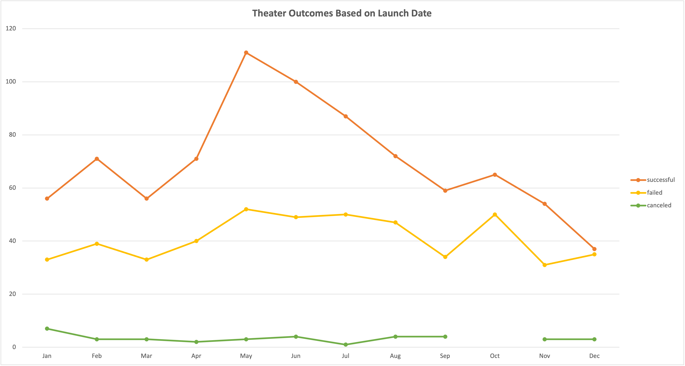
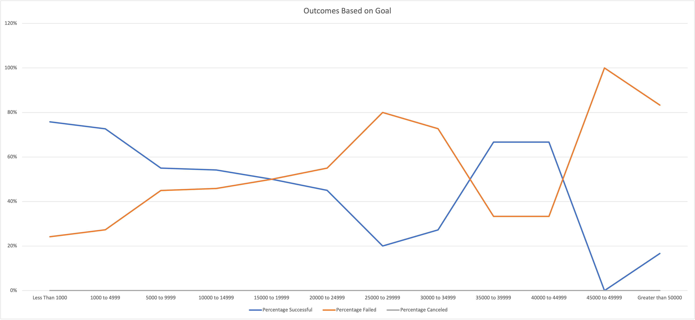

# Kickstarting with Excel
Performing analysis on Kickstarter data to uncover trends

## Overview of Project

We are making an analysis for Louise whose play 'Fever' reached her campaing goal in a short period of time. She wants to know how different campaigns fared in relation to their launch dates and fundraising goals. For this purpose, we are using Excel to create two analyses: outcomes based on goals and outcomes based on launch dates.

### Purpose
Our analysis can help Louise determine if she made the right choices of when she launched her campaign and for how much she set her campaign goa for her play 'Fever'. It will also help her future campaigns to be successful.

## Analysis and Challenges

### Analysis of Outcomes Based on Launch Date

Looking at the outcomes based on launch dates, we see that the month of May followed by June have the highest successful campaigns.

### Analysis of Outcomes Based on Goals

### Challenges and Difficulties Encountered

## Results

## - What are two conclusions you can draw about the Outcomes based on Launch Date?
1. From the line graph I infer that the theater campaigns are the most successful during the months of May followed by June. So it would be the best time of the year for Louise to launch her campaign.
2. Number of successful campaigns are double the number of failed campaigns during the months of May and June. Canceled Theater campaigns are consistently are very low for the entire year (below 10 canceled campaigns) for the Theater category. 
## - What can you conclude about the Outcomes based on Goals?
1. Campaigns for the Subcategory 'play' with goals less than $1000 have the highest success rate with high total number of projects. Closely followed by the $1000 to $4999 category which have the highest total number of campaigns.
## - What are some limitations of this dataset?

## - What are some other possible tables and/or graphs that we could create?
A box and whisker plot between the goal and the pledge amounts for the Theater category, can present a better picture of how high Louise can set her campaign's goal. We can also cross check if the most successful plays that fall in the less than $1000 and $1000 to $4000 category correlate with the amount of pledged amount.

